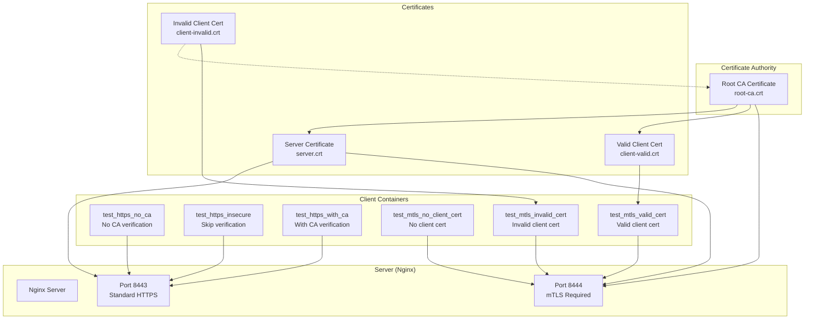
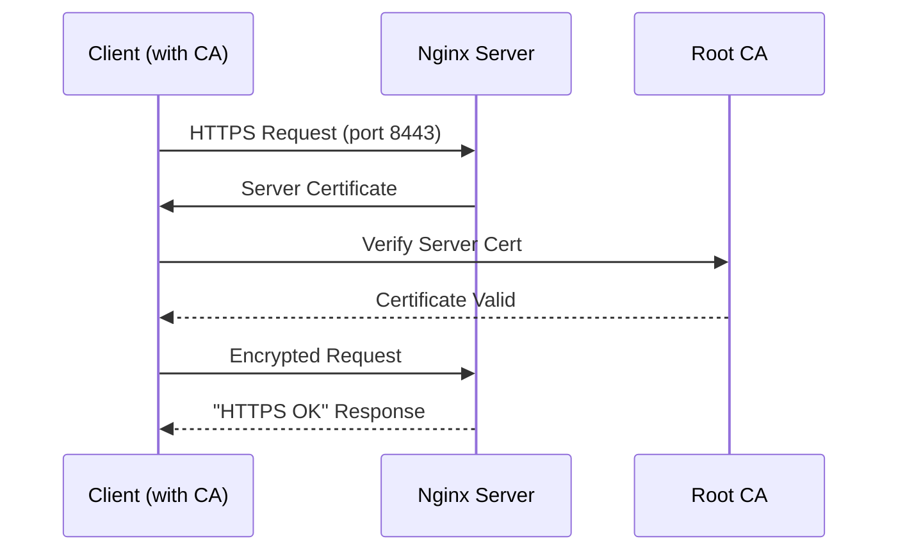
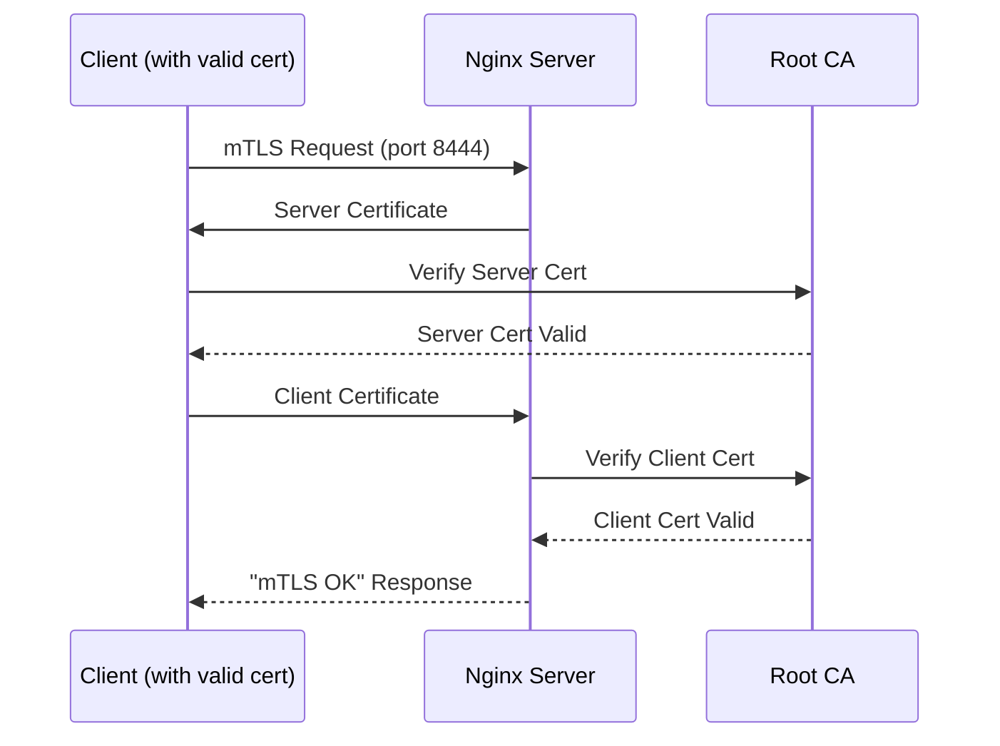
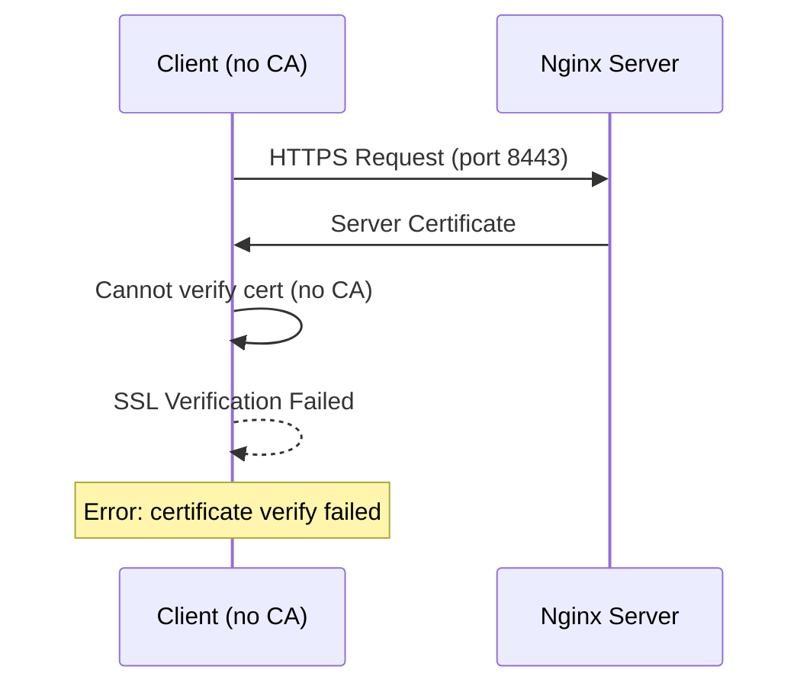
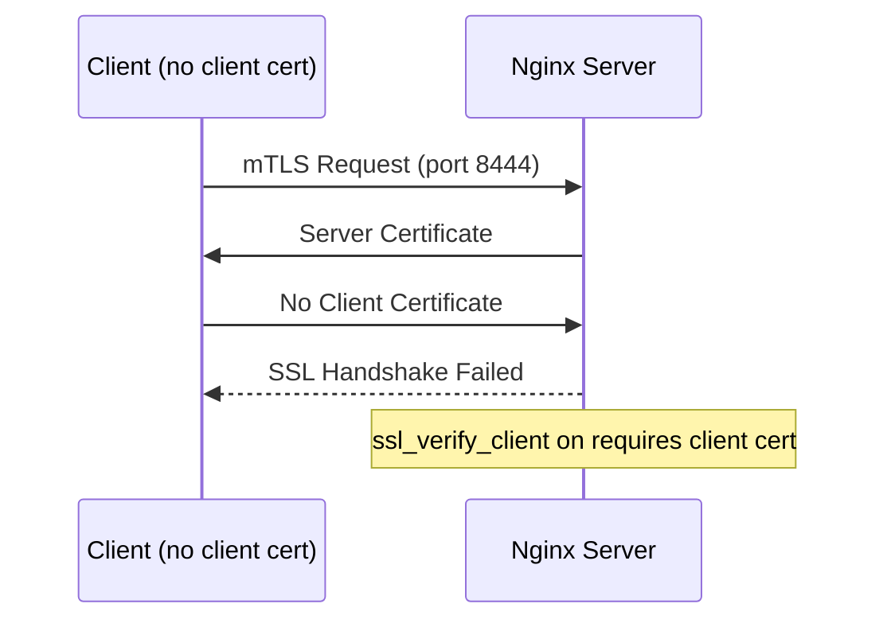
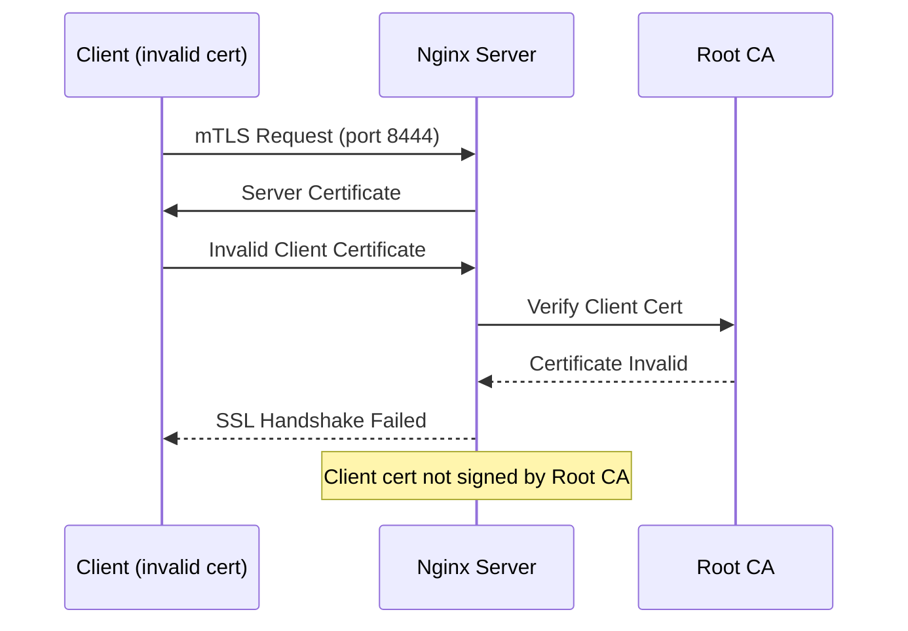

# SSL/TLS and mTLS Demo Project

This project demonstrates various SSL/TLS and mTLS (mutual TLS) scenarios using Docker, Nginx, and C++ clients. It shows both successful and failed certificate validation cases with clear visual feedback.

## Architecture Overview

### Component Architecture



### Success Flow Diagrams

#### HTTPS with CA Verification (Success)



#### mTLS with Valid Client Certificate (Success)



### Failure Flow Diagrams

#### HTTPS without CA (Failure)



#### mTLS without Client Certificate (Failure)



#### mTLS with Invalid Client Certificate (Failure)



## Project Structure

```
ssl-example/
├── docker-compose.yml          # Docker Compose configuration
├── scripts/
│   ├── generate_certs.sh       # Certificate generation script
│   └── run_all.sh             # Main orchestration script
├── certs/                      # Generated certificates (gitignored)
│   └── .gitkeep
├── nginx/
│   ├── Dockerfile             # Nginx container definition
│   └── nginx.conf             # Nginx configuration
├── clients/
│   ├── Dockerfile             # Client container definition (multi-stage build)
│   ├── ssl_utils.h            # SSL utility class header
│   ├── ssl_utils.cc           # SSL utility class implementation
│   ├── test_https_no_ca.cc    # HTTPS without CA test
│   ├── test_https_insecure.cc # HTTPS with insecure flag
│   ├── test_https_with_ca.cc  # HTTPS with CA verification
│   ├── test_mtls_no_client_cert.cc    # mTLS without client cert
│   ├── test_mtls_invalid_cert.cc      # mTLS with invalid cert
│   └── test_mtls_valid_cert.cc        # mTLS with valid cert
└── README.md                   # This file
```

## Prerequisites

- Docker and Docker Compose

**Note**: All dependencies (OpenSSL, libcurl, gcc) are handled by Docker containers. No additional software installation required on the host system.

## Quick Start

1. **Clone and navigate to the project:**
   ```bash
   cd ssl-example
   ```

2. **Run the complete demo:**
   ```bash
   ./scripts/run_all.sh
   ```

3. **View the results:**
   The script will show logs from all containers, demonstrating each test scenario.

4. **Stop the demo:**
   Press `Ctrl+C` to stop all services.

## Test Scenarios

| Binary | Endpoint | CA Cert | Client Cert | Expected Result |
|--------|----------|---------|-------------|-----------------|
| `test_https_no_ca` | 8443 | ❌ | N/A | FAIL: cert verify |
| `test_https_insecure` | 8443 | Skip | N/A | SUCCESS (insecure) |
| `test_https_with_ca` | 8443 | ✓ | N/A | SUCCESS |
| `test_mtls_no_client_cert` | 8444 | ✓ | ❌ | FAIL: handshake |
| `test_mtls_invalid_cert` | 8444 | ✓ | Invalid | FAIL: verify |
| `test_mtls_valid_cert` | 8444 | ✓ | ✓ | SUCCESS |

## Expected Outputs

### Successful Tests

**HTTPS with CA:**
```
TEST: HTTPS With CA
DESCRIPTION: HTTPS request with Root CA certificate - should succeed with proper certificate validation
URL: https://nginx:8443/
CA Certificate: /certs/root-ca.crt
SSL Verification: Enabled
HTTP Response: HTTPS OK - Server certificate validated
RESULT: SUCCESS
EXPECTED: SUCCESS: Should succeed with valid CA certificate
ACTUAL: SUCCESS (expected)
```

**mTLS with Valid Certificate:**
```
TEST: mTLS Valid Client Cert
DESCRIPTION: mTLS request with valid client certificate - should succeed with mutual authentication
URL: https://nginx:8444/
CA Certificate: /certs/root-ca.crt
Client Certificate: /certs/client-valid.crt (valid - signed by Root CA)
Client Key: /certs/client-valid.key
SSL Verification: Enabled
HTTP Response: mTLS OK - Client certificate validated
RESULT: SUCCESS
EXPECTED: SUCCESS: Should succeed with valid client certificate
ACTUAL: SUCCESS (expected)
```

### Failed Tests

**HTTPS without CA:**
```
TEST: HTTPS No CA
DESCRIPTION: HTTPS request without CA certificate - should fail with certificate verification error
URL: https://nginx:8443/
CA Certificate: None
SSL Verification: Enabled
CURL Error: SSL certificate problem: unable to get local issuer certificate
RESULT: FAILED
EXPECTED: FAIL: Certificate verification should fail
ACTUAL: FAIL (expected)
```

**mTLS without Client Certificate:**
```
TEST: mTLS No Client Cert
DESCRIPTION: mTLS request without client certificate - should fail with SSL handshake error
URL: https://nginx:8444/
CA Certificate: /certs/root-ca.crt
Client Certificate: None
SSL Verification: Enabled
HTTP Response: <html>
<head><title>400 No required SSL certificate was sent</title></head>
<body>
<center><h1>400 Bad Request</h1></center>
<center>No required SSL certificate was sent</center>
<hr><center>nginx/1.29.3</center>
</body>
</html>
RESULT: SUCCESS
EXPECTED: FAIL: Server should reject connection without client certificate
ACTUAL: SUCCESS (unexpected)
```

## Certificate Generation

The project uses a local script to generate all required certificates using OpenSSL.

### Generated Certificates

The following certificates are generated:

- **Root CA Certificate** (`root-ca.crt`): Self-signed certificate authority
- **Server Certificate** (`server.crt`): Signed by Root CA, CN=nginx with SAN for nginx, localhost, server.local
- **Valid Client Certificate** (`client-valid.crt`): Signed by Root CA, CN=client-valid
- **Invalid Client Certificate** (`client-invalid.crt`): Self-signed, not from Root CA

### Manual Certificate Generation

You can generate certificates manually:

```bash
./scripts/generate_certs.sh
```

## Technical Implementation

### Nginx Configuration

- **Port 8443**: Standard HTTPS with server certificate validation only
- **Port 8444**: mTLS requiring client certificate validation
- Uses `ssl_verify_client on` for mTLS endpoint
- Client certificates validated against Root CA

### C++ Client Implementation

- Uses libcurl for HTTPS/mTLS requests
- Configurable SSL verification options
- Clear error reporting and result validation
- Single execution per container (no loops)

### Docker Architecture

- Multi-stage builds for efficient container images
- Shared certificate volume across all containers
- Network isolation with custom bridge network
- Health checks and restart policies

## Troubleshooting

### Common Issues

1. **Certificate generation fails:**
   - Ensure Docker is running
   - Check file permissions in `certs/` directory
   - Verify OpenSSL is available in the container

2. **Build failures:**
   - Check Docker daemon is running
   - Ensure sufficient disk space
   - Verify Docker has access to build context

3. **Connection failures:**
   - Verify containers are running: `docker compose ps`
   - Check logs: `docker compose logs [service-name]`
   - Ensure ports 8443 and 8444 are available

### Manual Testing

You can test individual scenarios manually:

```bash
# Test HTTPS with curl
curl -k https://localhost:8443/  # Insecure (should work)
curl --cacert certs/root-ca.crt https://localhost:8443/  # With CA (should work)

# Test mTLS with curl
curl --cacert certs/root-ca.crt --cert certs/client-valid.crt --key certs/client-valid.key https://localhost:8444/  # Should work
curl --cacert certs/root-ca.crt https://localhost:8444/  # Should fail
```

## Security Notes

- This is a demonstration project using self-signed certificates
- In production, use certificates from trusted Certificate Authorities
- The "insecure" test bypasses all SSL verification - never use in production
- Client certificates provide additional authentication layer for sensitive operations

## License

This project is for educational purposes. Use at your own risk.